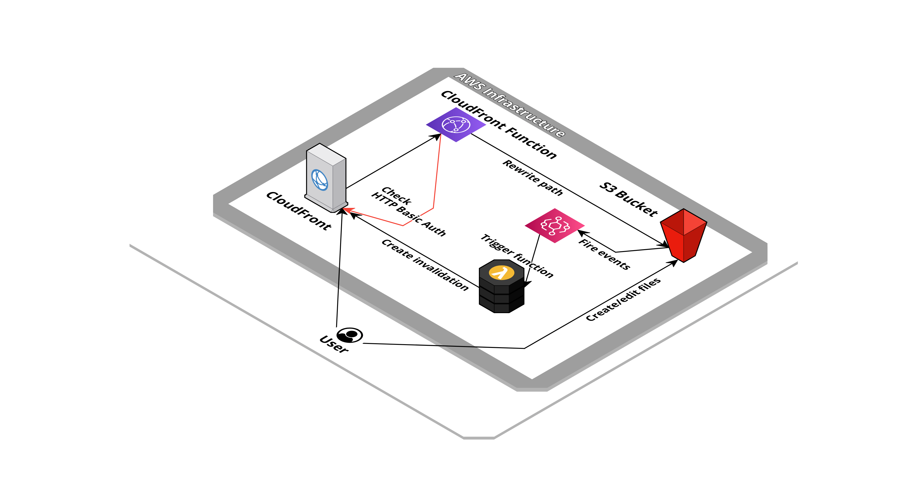

# Static Website


Simple static website management for SPA, PWA, static or JAM stack applications. Also provided a basic auth configuration and CORS management.

## Created resources

This application creates an S3 bucket that will contain the website content and a CloudFront distribution in front of it for caching purpose. CloudFront functions are used to provided the correct path rewrite and eventually checking a HTTP Basic auth, before request arrives to S3.

Furthermore, the application add an EventBridge rule that forward bucket's creation/deletion events to a Lambda function that automatically create invalidations on Cloudfront distribution for related paths. 



## Installation

| Region       | Deploy Link |
| ------------ | ----------- |
| eu-west-1    | [](https://eu-west-1.console.aws.amazon.com/cloudformation/home#/stacks/create/review?templateURL=https://bitbull-serverless-templates-butoamoogh8eigo.s3.eu-west-1.amazonaws.com/website-static/template.yml&stackName=website-static) |
| eu-central-1 | [](https://eu-central-1.console.aws.amazon.com/cloudformation/home#/stacks/create/review?templateURL=https://bitbull-serverless-templates-saijuozaeshae6e.s3.eu-central-1.amazonaws.com/website-static/template.yml&stackName=website-static) |
| us-east-1    | [](https://us-east-1.console.aws.amazon.com/cloudformation/home#/stacks/create/review?templateURL=https://bitbull-serverless-templates-chai7ephae5eet2.s3.us-east-1.amazonaws.com/website-static/template.yml&stackName=website-static) |
| us-east-2    | [](https://us-east-2.console.aws.amazon.com/cloudformation/home#/stacks/create/review?templateURL=https://bitbull-serverless-templates-xae9och1eipiem8.s3.us-east-2.amazonaws.com/website-static/template.yml&stackName=website-static) |

Using the [SAM CLI](https://docs.aws.amazon.com/serverless-application-model/latest/developerguide/what-is-sam.html):
```bash
sam build
sam deploy --guided
```

Including in an other SAM template:
```yaml
AWSTemplateFormatVersion: '2010-09-09'
Transform: AWS::Serverless-2016-10-31

Resources:
  WebsiteStatic:
    Type: AWS::CloudFormation::Stack
    Properties:
      TemplateURL: # pick a templates links from section below, based on your region
      Parameters:
        DomainName: "my-domain.com"
        HostedZoneId: xxxxxxxxxxxxxxxxxx
        AcmCertificateArn: "arn::" # need to be requested in us-east-1 region
        HttpAuthUsername: demo
        HttpAuthPassword: xxxxxxxxxxxxxxx
        RewriteExcludeRegEx: "(^/assets/|robots\\.txt$|favicon\\.ico$|favicon\\.svg$)"
```

## Public templates

| Region       | Template URLs                                                                                                  |
| ------------ | -------------------------------------------------------------------------------------------------------------- |
| eu-west-1    | https://bitbull-serverless-templates-butoamoogh8eigo.s3.eu-west-1.amazonaws.com/website-static/template.yml    |
| eu-central-1 | https://bitbull-serverless-templates-saijuozaeshae6e.s3.eu-central-1.amazonaws.com/website-static/template.yml |
| us-east-1    | https://bitbull-serverless-templates-chai7ephae5eet2.s3.us-east-1.amazonaws.com/website-static/template.yml    |
| us-east-2    | https://bitbull-serverless-templates-xae9och1eipiem8.s3.us-east-2.amazonaws.com/website-static/template.yml    |

## General parameters

This application need some parameters when you deploy it:

- **DomainName**: The domain name of website.

- **HostedZoneId**: The Route53 hosted zone ID used for the domain, if empty not Route53 record will be created.

- **AcmCertificateArn**: The certificate arn for the domain name provided.

- **IndexDocument**: The index document.

- **ErrorDocument**: The error document, ignored in SPA mode.

- **RewriteMode**: The request rewrite behaviour type (only `STATIC` or `SPA` value are allowed), default: `STATIC`.

- **RewriteExcludeRegEx**: Regular expression for authentication and path rewrite exclusion, default: `(^/assets/|robots\\.txt$|favicon\\.ico$|favicon\\.svg$)`.

- **CloudFrontPriceClass**: The price class for CloudFront distribution, default: `PriceClass_100`.

## Authentication parameters

- **HttpAuth**: Enable or disable the HTTP basic auth, default: `DISABLED`.

- **HttpAuthUsername**: HTTP Basic Auth username.

- **HttpAuthPassword**: HTTP Basic Auth password.

## CORS parameters

- **AllowedHeaders**: CORS Allowed headers, default: `*`.

- **AllowedMethods**: CORS Allowed methods, default: `GET,HEAD`.

- **AllowedOrigins**: CORS Allowed origins, default: `*`.

- **ExposedHeaders**: CORS exposed headers, default: `ETag`.


## Outputs

- **BucketName**: The S3 bucket name where HTML files need to be uploaded.

- **CloudFrontDistributionId**: The CloudFront distribution ID in front of the S3 bucket.

- **WebsiteUrl**: The website URL.

## Credits

- Repository badges by [Shields.io](https://shields.io/)
- Infrastructure schema by [Cloudcraft](https://www.cloudcraft.co/)
